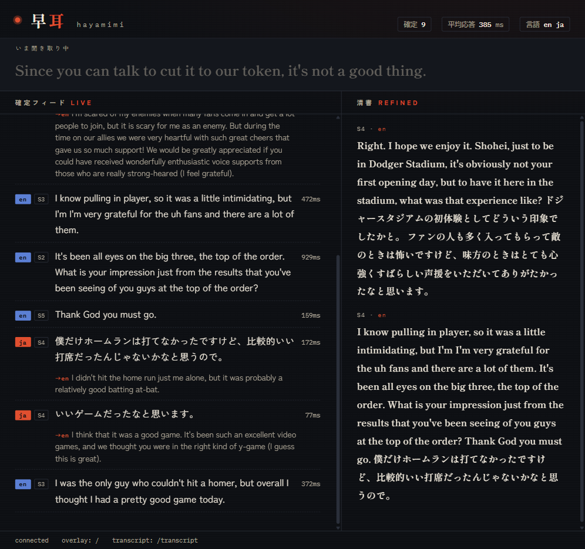

# hayamimi (早耳)

**CPUのみで動くリアルタイム多言語音声認識。** ライブ字幕・ブラウザダッシュボード・話者ラベル・
その場翻訳まで、GPUもクラウドAPIも使わず、メモリ2GB未満で動く。

English README is at [README.md](README.md).

「早耳」は聞き分けが早い人を指す言葉。設計目標もそのまま — 発話中にも速報字幕が出て、
話し終えてから**約100ms**で確定文が出る。

## なぜ作ったか

CPUのみのリアルタイム音声認識は、たいてい汎用モデル（Whisperなど）1つに頼り、その精度の
上限を受け入れることになる。hayamimiは代わりに、各発話をその言語に最も強いモデルへルーティングする。
すべて量子化（INT8）ONNXモデルとして[sherpa-onnx](https://github.com/k2-fsa/sherpa-onnx)上で動く
— PyTorchもCUDAも不要。

実放送日本語音声（`docs/SCORECARD.md`参照）でこのルーティングは**CER 5.8%**を達成し、
同じクリップでの`whisper-large-v3-turbo`の13.8%の半分以下。6コアデスクトップCPUで
実時間の10〜50倍速で動く。

## 機能

| 機能 | 内容 |
|---|---|
| 5ルート言語カタログ | 日/中/韓/広東語/英+欧州24言語をそれぞれ最適な専用モデルへ。それ以外（約1600言語）はMeta Omnilingual ASRにフォールバック |
| 速報字幕 | 発話中に約0.5秒ごとにドラフトテキストが更新される |
| 高速確定 | 話し終えてから約100msで確定文が出る（日本語。他言語は`docs/GOALS.md`参照） |
| 二段パス補正 | 2秒の無音後、直近の発話群を一括再デコードし高精度な「清書」トランスクリプトを生成（実放送ja CER 15.5%→12.0%） |
| 話者ラベル | `--speakers`でCAM++話者埋め込みを使いS1/S2/...とタグ付け（ターンテイキング方式、フル話者分離ではない） |
| 翻訳 | `--translate en,zh,ko`で日本語行をリアルタイム翻訳（en=FuguMT、zh/ko=M2M-100） |
| ホットワード/置換辞書 | `--hotwords`で固有名詞認識を強化、`--replace`で事後の検索置換 |
| OBSオーバーレイ+ダッシュボード | `--serve`でローカルHTTPサーバーを起動、ブラウザソースオーバーレイとライブダッシュボードを提供 |
| メモリ上限管理 | LRUモデル退避で常駐モデルを上限内（既定<2GB）に制御 |
| CPUのみ | すべてのモデルがsherpa-onnx経由の量子化ONNXとして動作。GPU・PyTorch不要 |

## デモUI

`--serve`はローカルサーバーを起動し、3つのビューを提供する:

- **`http://localhost:8765/dashboard`** — ライブダッシュボード。発話中のテキストを表示する
  速報ストリップ、言語バッジ・話者チップ・行ごとのレイテンシ付きの確定フィード、各行に
  インライン表示される翻訳、そして二段パス補正済みの清書トランスクリプトを表示する2列目。
- **`http://localhost:8765/`** — シンプルなOBSブラウザソースオーバーレイ
  （このURLをOBSのブラウザソースに追加すれば配信字幕として使える）。
- **`http://localhost:8765/transcript`** — プレーンなスクロール式トランスクリプト履歴。



## クイックスタート

```bash
python -m venv .venv

# Windows
.venv\Scripts\pip install -r requirements.txt
.venv\Scripts\python scripts\download_models.py

# macOS / Linux
.venv/bin/pip install -r requirements.txt
.venv/bin/python scripts/download_models.py

# マイクからリアルタイム認識
.venv/Scripts/python scripts/realtime_transcribe.py     # Windows
.venv/bin/python scripts/realtime_transcribe.py          # macOS/Linux

# ダッシュボード + OBSオーバーレイ付き
.venv/Scripts/python scripts/realtime_transcribe.py --serve
# -> ブラウザで http://localhost:8765/dashboard を開く
```

`scripts/download_models.py`は約3.1GBの学習済みモデルを`models/`（git管理外）にダウンロードする。
`--minimal`を付けると日英のみの約1.1GB構成（ReazonSpeech・whisper-tiny・Silero VAD・日本語句読点）になる。
各モデルのライセンス条件は`THIRD_PARTY_NOTICES.md`を参照。

## CLIリファレンス

すべてのフラグは`scripts/realtime_transcribe.py`にある:

| フラグ | 既定値 | 説明 |
|---|---|---|
| `--wav PATH` | マイク入力 | マイクの代わりに16kHzモノラルWAVファイルからのストリーミングをシミュレート |
| `--no-realtime` | オフ | `--wav`使用時、チャンク間でスリープしない（高速バッチ処理） |
| `--threads N` | 4 | モデルごとの推論スレッド数 |
| `--no-partial` | オフ | 発話中の速報字幕を無効化 |
| `--min-silence SEC` | 0.35 | 発話終了とみなす無音時間。小さいほど確定が速くなるが分割も増える |
| `--max-speech SEC` | 12.0 | 連続発話がこの秒数を超えたら強制的に確定させる |
| `--max-resident N` | 3 | tier0以外で常駐させるモデル数の上限（LRU退避）。`0`以下で無制限 |
| `--serve [PORT]` | オフ、8765 | `http://localhost:PORT`でダッシュボード+OBSオーバーレイを配信 |
| `--no-refine` | オフ | 発話群の二段パス再デコードを無効化 |
| `--transcript PATH` | なし | 清書済みトランスクリプト行をこのファイルに追記 |
| `--hotwords PATH` | なし | 日本語デコードを固有名詞側に寄せるホットワード一覧（1行1語） |
| `--replace PATH` | なし | ユーザー辞書。`誤=正`形式、1行1組。全出力に適用 |
| `--lang-switch-guard SEC` | 2.0 | この秒数未満の新言語判定はノイズとみなしセッション言語を維持（`0`で無効） |
| `--speakers` | オフ | 発話に話者ID（S1, S2, ...）をラベル付け |
| `--translate [LANGS]` | オフ、`en` | 日本語行をカンマ区切りの言語（`en`/`zh`/`ko`）に翻訳 |

## アーキテクチャ

```
                          ┌─────────────┐
  マイク/wav ───────────▶ │ Silero VAD  │  0.35秒終端検出 + 0.8秒プリロール
                          └──────┬──────┘
                                 │ 発話セグメント
                                 ▼
                   ┌───────────────────────────┐
                   │ whisper-tiny 言語判定       │  セグメント受信中の最初の
                   │ (+ 文字種仲裁)              │  約4秒間で実行
                   └─────────────┬─────────────┘
                                 │ 言語タグ
                 ┌───────────────┼────────────────┬─────────────┬──────────────┐
                 ▼               ▼                ▼             ▼              ▼
             ┌───────┐      ┌─────────┐      ┌──────────┐  ┌─────────┐   ┌──────────┐
             │  ja   │      │   zh    │      │  ko/yue  │  │ en + 24 │   │  約1600  │
             │Reazon │      │Paraformer│      │SenseVoice│  │欧州言語 │   │  その他  │
             │Speech │      │   -zh   │      │  small   │  │Parakeet │   │Omnilingual│
             │Zipform│      │         │      │          │  │TDT v3   │   │  ASR     │
             └───┬───┘      └────┬────┘      └────┬─────┘  └────┬────┘   └────┬─────┘
                 └───────────────┴────────────────┴─────────────┴─────────────┘
                                                │
                    速報字幕（約0.5秒ごと）        │   確定（発話終了から約0.1秒）
                     ◀───────────────────────────┴───────────────────────▶
                                                │
                          ┌─────────────────────┼─────────────────────┐
                          ▼                     ▼                     ▼
                 ┌────────────────┐   ┌──────────────────┐   ┌────────────────┐
                 │ 日本語句読点付与  │   │ 話者ラベリング      │   │  翻訳           │
                 │ (BERT復元)      │   │ (CAM++, --speakers)│   │ (FuguMT/M2M-100)│
                 └────────────────┘   └──────────────────┘   └────────────────┘
                                                │
                       2秒無音: 直近の発話群を一括再デコード（二段パス補正）
                                                │
                                                ▼
                            ダッシュボード / OBSオーバーレイ / トランスクリプトファイル
```

モデルは初回使用時に遅延ロードされる。LRUキャッシュが最も使われていない非日本語モデルを
退避させる（`--max-resident`）ため、セッション中にどれだけ多くの言語をまたいでもメモリは
上限内に収まる。

## 実測パフォーマンス

エンドツーエンド（言語判定→ルーティング→デコード→日本語句読点付与）、実音声、
プリロール・二段パスなし（単発クリップ）。`en`はWER、それ以外はCER（`yue`はt2s正規化）。
詳細な手法は`docs/SCORECARD.md`参照。

| 言語 | クリップ数 | LID正解率 | ルート | 平均誤り率 | 平均RTF |
|---|---|---|---|---|---|
| ja | 15 | 15/15 | ReazonSpeech | 7.5% | 0.071 |
| en | 15 | 15/15 | Parakeet v3 | 2.3% | 0.109 |
| zh | 12 | 12/12 | Paraformer-zh | 5.3% | 0.102 |
| ko | 12 | 12/12 | SenseVoice | 8.1% | 0.062 |
| yue | 12 | 12/12 | SenseVoice | 6.1% | 0.061 |

全ルートでRTFが0.2を大きく下回っている、つまりCPU単体で実時間の9〜16倍速で動作する。
目標値の全体は`docs/GOALS.md`、30回以上の改善イテレーション全履歴（レイテンシ・メモリ・
精度のトレードオフとその採否理由）は`docs/BENCHMARKS.md`を参照。

その記録からの主要な数値:

- **日本語CER 5.8%**（ビームサーチ）、実放送音声で `whisper-large-v3-turbo`（同クリップで13.8%）
  の半分以下の誤り率。
- **平均確定レイテンシ約100ms**（日本語、句読点付き）。5言語ソークテスト・全機能有効時は
  平均236ms・最大552ms。
- **メモリ2GB未満**（`--max-resident 3`）。`--max-resident 2`なら1.35GB。

## 制限事項（正直に書く）

- **1文内でのコードスイッチング（言語混在）は非対応。** ルーターは発話1つにつき1言語を選ぶため、
  1文内で日本語と英語が混ざると少数派言語の部分が化けるか欠落する。発話単位の切り替え
  （通訳が文単位で日英を交互に話す等）は問題なく追従するが、1文内の単語レベル混在は対応不可。
- **ジングル・効果音・BGMの直後の短い発話は誤ルーティングしうる。** 言語切替ガード
  (`--lang-switch-guard`)で緩和しているが、セッション最初の発話（まだセッション言語が
  確立していない）と、化けたテキストが偶然別言語の文字種と整合してしまうケースは既知の
  盲点として残る（定量化した例は`docs/BENCHMARKS.md`のイテレーション#29参照）。
- **重なった2人の話者は分離できない。** `--speakers`はターンテイキング方式の話者ラベリング
  （確定VADセグメントごとに1つの埋め込み、最近傍セントロイドへの割り当て）であり、
  真の話者分離ではない。同時発話は1つのラベルにまとめられる。
- **翻訳品質には現実的な上限がある**（チューニング不足ではなく）。FuguMT（ja→en）と
  M2M-100（ja→zh/ko）は小型モデルで、繰り返しループは抑制されているが完全には解消されておらず、
  ja→zh/koの翻訳では数値が確実には保持されない（数値・金額に関わる用途で使う前に
  `docs/TRANSLATE.md`と`docs/TRANSLATE_M2M.md`の実測の失敗例を確認すること）。
- **エンドツーエンドのマイクパイプラインは、本プロジェクトの検証以外での独立した検証は
  行われていない** — 残課題は`docs/GOALS.md`参照。上記の数値と結果が異なる場合はIssueを立ててほしい。

## ライセンス

ソースコードはMIT（`LICENSE`、著作権者oboroge0）。このリポジトリにモデルの重みは
含まれていない — `scripts/download_models.py`がインストール時に各モデルを配布元から
取得する。それぞれ個別のライセンスを持つ（一覧は`THIRD_PARTY_NOTICES.md`）。

**1つだけ非permissiveなモデルがある:** ja→en翻訳モデル（`mojicast-fugumt-ja-en-ct2`、
`--translate en`で使用）は**CC BY-SA 4.0（継承ライセンス）**。このモデルの重みを
再配布する場合はクレジット表示を維持し、再配布物もCC BY-SA 4.0で公開する必要がある。
これはhayamimi自体のコードのライセンスには影響せず、`--translate zh,ko`（M2M-100, MIT）にも影響しない。

## クレジット

hayamimiは以下のプロジェクトの上に成り立っている:

- [k2-fsa/sherpa-onnx](https://github.com/k2-fsa/sherpa-onnx) — ここで動く
  すべてのモデルの推論基盤であるONNX Runtimeエンジン。
- [ReazonSpeech](https://research.reazon.jp/)（Reazon Human Interaction Lab）
  — このプロジェクトの精度の根拠となっている日本語ASRモデル。
- [NVIDIA NeMo / Parakeet](https://huggingface.co/nvidia/parakeet-tdt-0.6b-v3)
  — 英語+欧州24言語。
- [Meta AI Omnilingual ASR](https://github.com/facebookresearch/omnilingual-asr)
  — 「多言語対応」を嘘にしない約1600言語フォールバック。
- [FunASR / SenseVoice](https://github.com/FunAudioLLM/SenseVoice)
  （Alibaba DAMO Academy）— 中国語・韓国語・広東語のASR。
- [Mojicast](https://github.com/ishiki-emo/mojicast)（ishiki-emo）—
  ライブ字幕パイプラインの設計面での着想元であり、本プロジェクトが使う
  句読点/翻訳モデルの変換版の出所。Mojicast自体、完全オフラインで動く
  配信字幕アプリとして一見の価値あり。
- [Silero VAD](https://github.com/snakers4/silero-vad) — 発話区間検出。
- [3D-Speaker](https://github.com/modelscope/3D-Speaker)
  （Alibaba DAMO Academy）— `--speakers`が使うCAM++話者埋め込みモデル。
- [Kiwi](https://github.com/bab2min/kiwipiepy) — SenseVoiceのトークン間
  スペース混じりの韓国語出力を補正する韓国語形態素解析器。

## Contributing

`CONTRIBUTING.md`参照。
